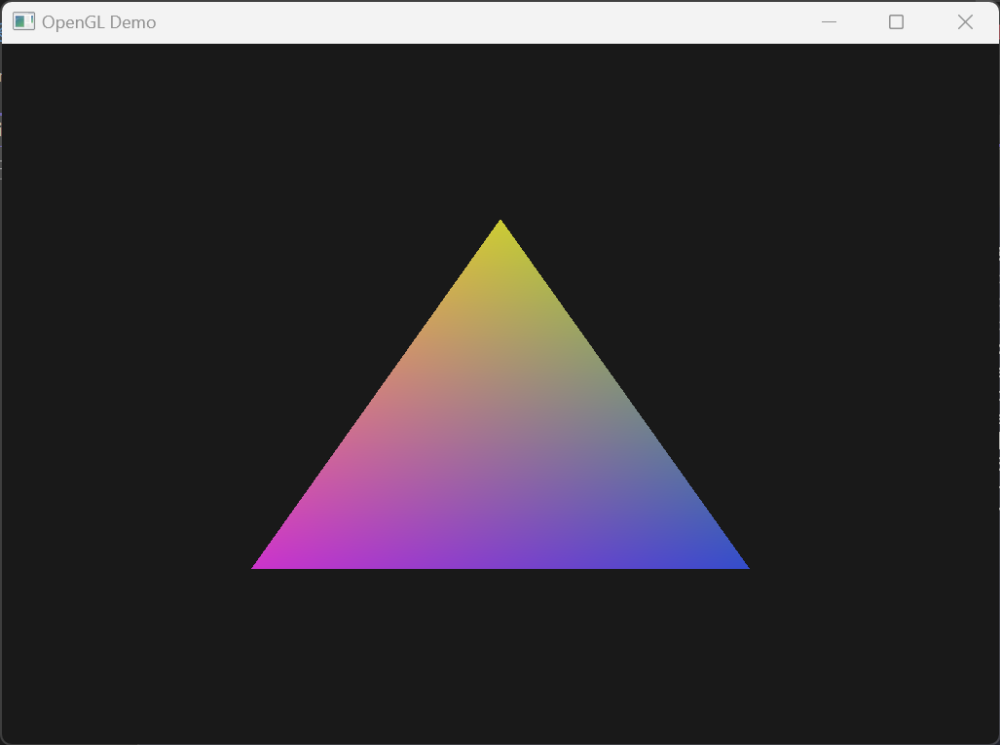
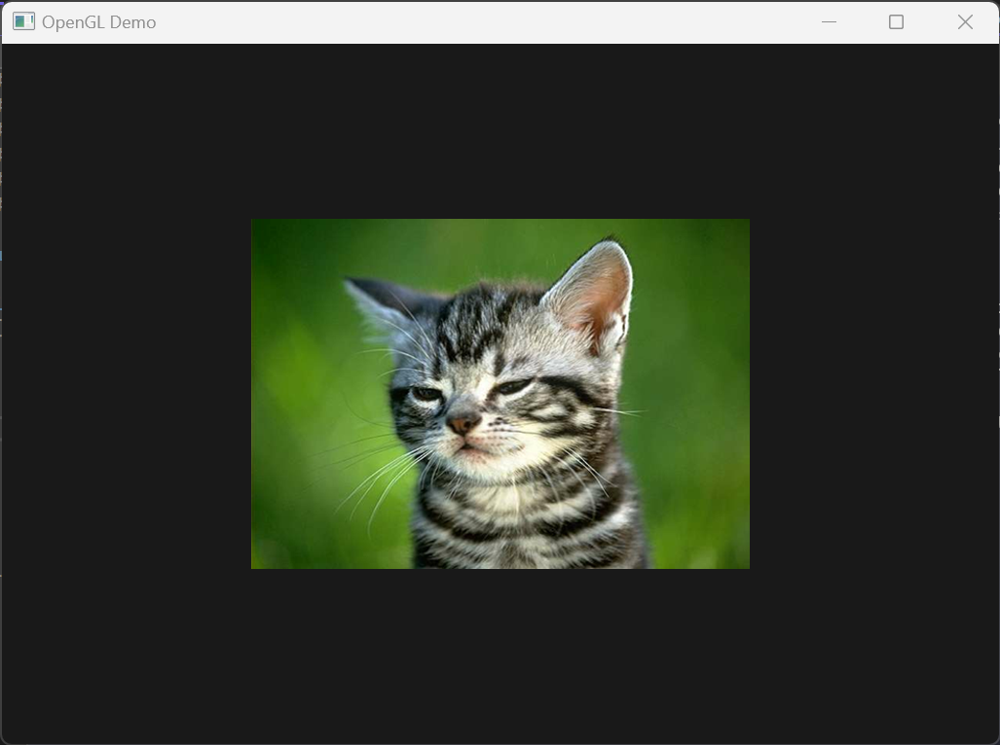

# OpenGL Examples

<div float="left">
  
  
  
  
</div>

# Description

Some basic examples of rendering 2D and 3D geometry using C++ and OpenGL.

The app is made while learning myself game programming by following tutorials made by [TheCherno][thecherno] on YouTube.

The app requires Windows and Visual Studio to run.

# Prerequisites&nbsp;:vertical_traffic_light:

- [Git][git]
- [Visual Studio][msvs] (Windows)

# Getting started&nbsp;:runner:

### Getting the code&nbsp;:octocat:

- Clone the repository: `git clone https://github.com/taardal/opengl-examples`

### Running the app&nbsp;:rocket:

- Open the solution file in Visual Studio: `opengldemo.sln`
- Uncomment the example to run in `opengldemo/src/Main.cpp`:
```cpp
application->PushLayer(new TriangleLayer());
//application->PushLayer(new TextureLayer());
//application->PushLayer(new Texture3DLayer());
//application->PushLayer(new TexturedCubeLayer());
```

# Resources&nbsp;:books:

- [The Cherno: Game Engine Series][thecherno:gameengineseries] (YouTube)
- [The Cherno: OpenGL][thecherno:opengl] (YouTube)
- [The Cherno: C++][thecherno:cpp] (YouTube)
- [OpenGL Tutorial][opengltutorial] (Website)
- [Learn OpenGL][learnopengl] (Website)


[git]: https://git-scm.com
[learnopengl]: https://learnopengl.com/
[msvs]: https://visualstudio.microsoft.com/
[opengltutorial]: http://www.opengl-tutorial.org/
[thecherno]: https://www.youtube.com/@TheCherno
[thecherno:cpp]: https://www.youtube.com/watch?v=18c3MTX0PK0&list=PLlrATfBNZ98dudnM48yfGUldqGD0S4FFb&ab_channel=TheCherno
[thecherno:gameengineseries]: https://www.youtube.com/watch?v=JxIZbV_XjAs&list=PLlrATfBNZ98dC-V-N3m0Go4deliWHPFwT&ab_channel=TheCherno
[thecherno:opengl]: https://www.youtube.com/watch?v=W3gAzLwfIP0&list=PLlrATfBNZ98foTJPJ_Ev03o2oq3-GGOS2&ab_channel=TheCherno
